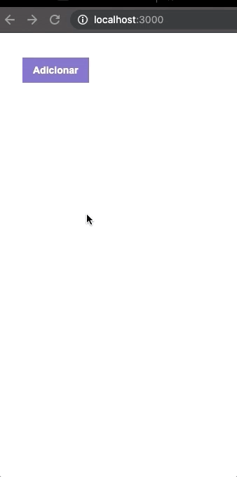

# Exemplo de listagem com React
> Nesse exemplo, ao clicar em adicionar um novo item é enviado para um servidor e adicionado a lista.
Ao remover esse item, é enviado um DELETE para o servidor e atualizado o estado da lista com o item removido, sem nova requisição ao servidor.




## Instalação

```sh
yarn 
```

## Inicio

```sh
yarn start
```

## Teste

```sh
yarn test
```

## Perfil
Alan Fernandes - https://www.linkedin.com/in/alan-fernandes-78153a22/